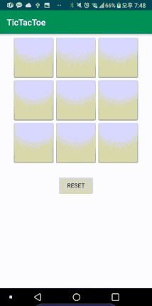

# TicTacToe

## Summary
A simple tic tac toe app, to illustrate the use of MVC architectures to organize the application.
 
 - Android Application
 - Language : Kotlin
 
 
 if you want to see MVVM model. click below link

https://github.com/Origogi/TicTakToe_MVVM
 
## Screenshot

